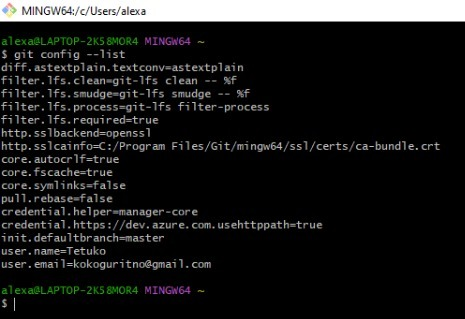
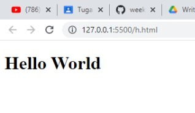
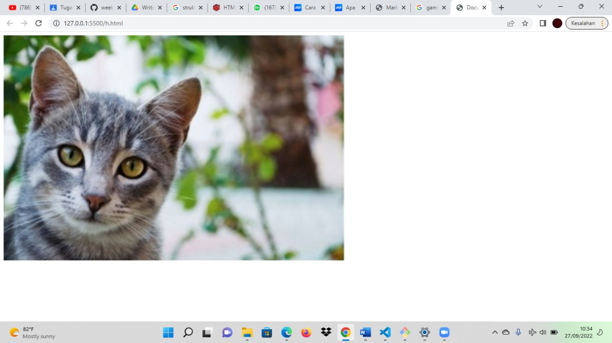
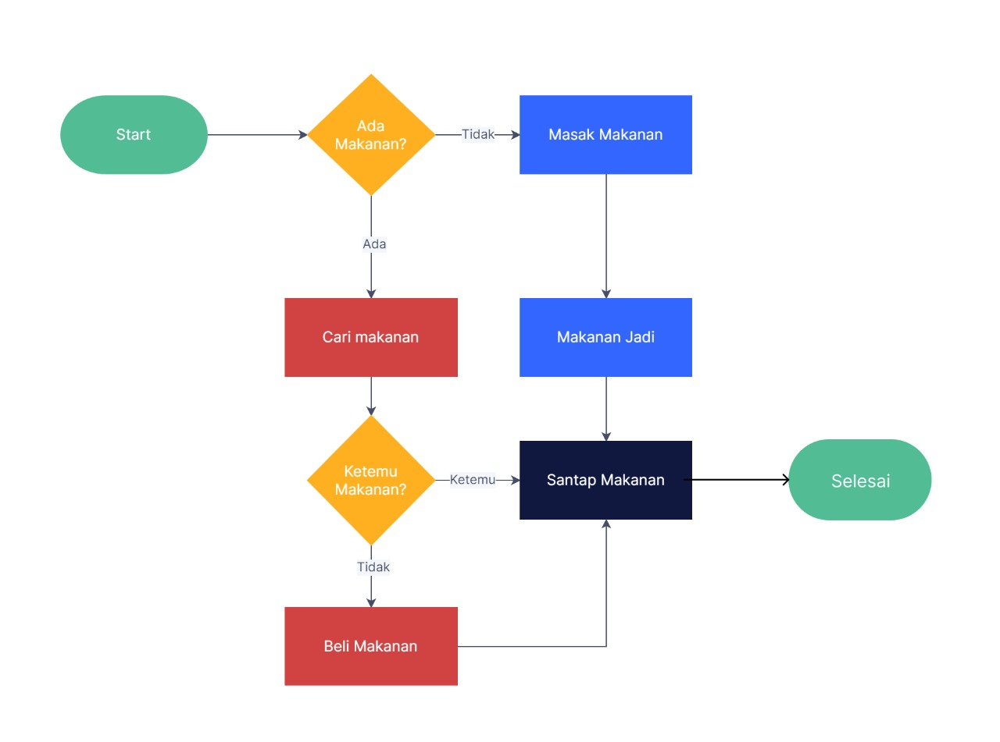

# Materi Week 1

## 1. Unix Command Line

- ### CLI (_Command Line Interface_)

  CLI sebagai program, pengguna bisa memberikan perintah dalam bentuk teks, kemudian memberikan instruksi dan melakukan tugas tertentu.

- ### Shell

  Shell adalah user interface yang bertugas untuk memproses semua perintah yang diketik di CLI. Shell membaca dan mengartikan perintah, lalu menginstruksikan sistem operasi untuk menjalankan task sesuai permintaan.

- ### Contoh CLI

  - Sh
  - Bash
  - Zsh
  - Cmd

- ### Cara mengakses CLI

  Cara mengakses CLI kita isa menggunakan terminal emulator, untuk struktur baris perintahnya yaitu seperti ini _`command -options argument`_ .

  - Command yaitu berisi perintah yang akan kita jalankan
  - Options yaitu keterangan tambahan tentang perintah yang akan kita jalankan
  - Argument yaitu nilai yang kita berikan sebagai bagian dari perintah

- ### File System Structure

  Sistem file (file system) atau sistem berkas merupakan struktur logika yang digunakan untuk mengendalikan akses terhadap data yang ada pada disk. Dengan kata lain, sistem file merupakan database khusus untuk penyimpanan, pengelolaan, manipulasi dan pengambilan data, agar mudah ditemukan dan diakses.

  Struktur direktori terdiri dari induk direktori yang memiliki atau didalamnya terdapat anak direktori (subdirektori) atau juga bisa berupa file, dan didalam subdirektori juga bisa terdapat subdirektori lagi dan beberapa file juga.

- ### Perintah Unix Command Line

  - **Pwd** : melihat current working directory
  - **ls** : Melihat isi direktori
  - **cd** : Berpindah directory
  - **cat** : Melihat isi file
  - **mkdir** : Membuat file & direktori baru
  - **cp** : Menyalin file & direktori
  - **mv** : Memindahkan dan mengubah nama file & direktori
  - **rm** : Menghapus file & direktori

---

## 2. Git & GitHub

- ### Git

  Git merupakan software berbasis Version Control System (VCS) yang bertugas untuk mencatat perubahan seluruh file atau repository suatu project. Developer software biasa menggunakan Git untuk distributed revision (VCS terdistribusi), hal ini bertujuan untuk menyimpan database tidak hanya ke satu tempat. Namun semua orang yang terlibat dalam penyusunan kode dapat menyimpan database ini.

- ### GitHub

  GitHub merupakan layanan cloud yang berguna untuk menyimpan dan mengelola sebuah project yang dinamakan repository (repo git). Cara kerja pada GitHub harus terkoneksi pada internet sehingga tidak perlu meng-install sebuah software ke dalam perangkat keras. Hal ini memberikan keringanan penyimpanan komputer yang kita gunakan karena file project tersimpan oleh cloud GitHub

- ### Cara menggunakan Git & GitHub

  1. **Install Git** - caranya download dulu file Gitnya [disini](https://git-scm.com/downloads), Setelah selesai mengunduh file Git, buka setup aplikasi Git untuk memulai proses instalasi. dan ikuti alur instalasi sampai sukses terinstall.
  2. **Login Git** - Untuk login Git bisa menggunakan akun GitHub, GitLab atau akun Bitbucket dengan cara masukkan username GitHub, GitLab maupun Bitbucket menggunakan perintah di bawah ini. Lalu tekan _**ENTER**_ jika sudah benar.

     ```shell
     $ git config --global user.name "UsernameAnda"
     ```

     Kemudian masukkan email yang terdaftar di GitHub menggunakan perintah di bawah ini. Lalu tekan _**ENTER**_ jika sudah benar.

     ```shell
     $ git config --global user.email IsiDenganEmailAnda@gmail.com
     ```

     Kemudian untuk mengecek apakah proses login berhasil atau tidak bisa menggunakan perintah di bawah ini.

     ```shell
     $ git config --list
     ```

     Jika diklik _**Enter**_ maka akan muncul seperti pada gambar berikut

     

  3. **Buat Folder Pada GUI Windows** - Selanjutnya, buat folder pada local disk komputer. Fungsinya adalah untuk menyimpan update file dari repository GitHub yang telah kita buat sebelumnya pada web GitHub.
  4. **Buka Folder Menggunakan Git Bash** - Setelah berhasil membuat folder pada local disk komputer, buka folder tersebut dengan cara klik kanan lalu pilih **Git Bash Here**.
  5. **Ubah Folder Menjadi Repository** - Setelah itu, ubah folder tersebut menjadi repository menggunakan perintah berikut :
     ```shell
     $ git init
     ```
  6. **Tambahkan File ke Repository** - Sebelum menambahkan file ke repository, kita perlu membuat filenya didalam folder yang telah kita buat sebelumnya, misalkan kita buat file bernama **_index.php_**. Setelah berhasil dibuat lalu tambahkan file tersebut ke dalam repository menggunakan perintah berikut :
     ```shell
     $ git add index.php
     ```
  7. **Buat Commit** - Commit berfungsi untuk menambahkan update file serta komentar. Jadi setiap kontributor bisa memberikan konfirmasi update file di proyek yang sedang dikerjakan. Masukkan perintah berikut untuk membuat Commit:
     ```shell
     $ git commit -m "first commit"
     ```
  8. **Remote Repository GitHub** - Remote repository berfungsi untuk mengupload file yang telah dibuat sebelumnya di local disk. Masukkan perintah berikut ini untuk melakukan remote repository:
     ```shell
     $ git remote add origin git@github.com:UserNameGit/NamaRepository.git
     ```
  9. **Push GitHub** - Langkah terakhir adalah push ke GitHub Push ini berfungsi untuk mengupload hasil akhir dari langkah-langkah di atas. Masukkan perintah berikut untuk melakukan push ke GitHub :
     ```shell
     git push -u origin master
     ```

- ### Cara Clone Repository ke Lokal

  Github menyediakan banyak sekali fitur bagi penggunanya, salah satunya ialah integrasi dengan aplikasi Git yang dapat memudahkan kita untuk melakukan proses clone atau duplikasi sebuah konten pada repositori Github. Berikut cara clone Repositori Github menggunakan Git.

  1. **Langkah Pertama** - Cari repositori Github yang ingin kita clone ke direktori kita. Pada bagian halaman repositori, klik tombol Clone or Download, lalu copy link yang terdapat pada kolom teks yang telah disediakan.
  2. **Langkah Kedua** - Setelah mendapatkan link-nya, buat folder pada direktori kita yang nantinya akan menjadi destinasi dari repositori yang akan kita clone. Jika sudah, maka klik kanan folder tersebut, lalu pilih opsi **_Git Bash Here_**. Nantinya akan muncul halaman baru berupa aplikasi Git.
  3. **Langkah Ketiga** - Pada aplikasi Git, masukkan perintah berikut :
     ```shell
     git clone LINK_REPOSITORI
     ```
     Menggunakan perintah di atas, kita akan meminta server Github untuk mengirimkan informasi dari link repositori yang telah disediakan.
  4. **Langkah Keempat** - Jika link dapat terbaca oleh server Github, nantinya semua file yang berkaitan dengan link tersebut akan di unduh menuju lokasi yang telah kita tetapkan sebelumnya. Lama proses pengunduhan menyesuaikan dengan jumlah serta ukuran file yang terdapat pada repositori Github.

     Jika proses pengunduhan telah selesai dilakukan, nantinya pada direktori yang di tuju, akan terdapat sebuah direktori yang memiliki nama yang sama dengan nama dari repositori yang kita clone. Artinya, file hasil clone telah siap untuk digunakan.

---

## 3. HTML (Hyper Text Markup Language)

> HTML adalah bahasa komputer yang digunakan untuk membuat kerangka atau struktur untuk Web pages (halaman website) di internet.

- ### Mengenal Tag HTML, elemen dan atribut

  Secara umum HTML terdiri dari Tag, Element dan Atribute. Untuk Lebih jelasnya mari kita bahas satu persatu

  1. **Tag** - Tag adalah tanda awalan dan akhiran dalam perintah HTML yang akan dibaca oleh web browser. Tag dibuat dengan menggunakan kurung siku <…>, di mana di dalamnya berisi nama tag. Pada umumnya, ada 2 tipe HTML Tag :

     1. Opening Tag (tag pembuka) -> contohnya adalah
        ```html
        <p></p>
        ```
     2. Closing Tag (tag penutup) - contohnya adalah
        `html </p> `
        Tag HTML sendiri awalnya hanya berjumlah 18. Hingga saat ini sudah ada lebih dari 250 tag. Tapi ada beberapa Tag yang sering digunakan, seperti berikut :

        ```html
        <html></html>
        ```

        Berikut adalah beberapa Tag yang sering digunakan oleh programer dalam menyusun sintax HTML

        - `<html>` Untuk memulai membuat halaman HTML yang mencakup semua konten dan elemen.
        - `<head>` Untuk membuat halaman HTML yang mencakup tampilan deskripsi di hasil pencarian Google, style konten (CSS), dan lainnya.
        - `<title>` Untuk membuat judul website.
        - `<body>` Untuk membuat bagian isi website.
        - `<h1>` sampai `<h6>` Untuk membuat bagian heading pada artikel.
        - `<p>` Untuk membuat paragraf.
        - `<a>` Untuk menautkan link.
        - `` Untuk menautkan gambar.
        - `<!– –>` Untuk membuat komentar.

  2. **Elemen** - Elemen merupakan komponen HTML yang berupa keseluruhan kode dari tag pembuka hingga tag penutup. Elemen terdiri dari teks dan simbol yang berupa tag pembuka, isi tag atau konten, dan tag penutup. Contoh :

     ```html
     <h1>Hello World</h1>
     ```

     Hasilnya :

     

  3. **Atribut** - Atribut adalah informasi atau perintah tambahan yang berada dalam elemen. Atribut ini berfungsi sebagai penjelas perintah tag pada elemen. Contoh :

     ```html
     
     ```

     Hasilnya :

     

- ### Struktur HTML

  Setiap halaman HTML sudah pasti mempunyai struktur dasar yang terdiri dari : tag Doctype, tag html, tag head, dan tag body. Ini lah struktur dasar dari HTML. Sebenarnya masih banyak struktur lainnya, untuk awalan teman-teman mempelajari struktur dasar sebagai penunjang materi selanjutnya.

  ```html
  <!DOCTYPE html>
  <html>
    <head>
      <title>Judul Website</title>
    </head>
    <body>
      <p>Konten Website</p>
    </body>
  </html>
  ```

  Penjelasan

  1. Tag **Doctype** adalah tag yang menyatakan bahwa kode dibawah adalah dokumen html. Berfungsi untuk memberitahu akan dokumen yang akan dijalankan pada browser.

  2. Tag **html** adalah tag pembuka dan penutup dari keseluruhan sebuah dokumen html

  3. Tag **head** umumnya berisi elemen yang tidak tampak pada browser, seperti memanggil css, membuat judul website, membuat favicon, dan lain-lain. intinya di dalam tag head tidak akan tampil di browser.

  4. Tag **body** sebaliknya, berisi elemen yang akan tampak pada browser. Seperti paragraf, memasukkan gambar, dan lain-lain.

- ### Aplikasi penyusun HTML paling populer

  - Visual Studio Code
  - Sublime Text Editor
  - Atom Text Editor

- ### Rekomendasi Extensions Visual Studio Code

  - live server
  - prettier
  - auto close tag
  - auto rename tag
  - color picker

- ### Elemen Simantik

  > Elemen semantik adalah elemen-elemen yang menyatakan makna atau tujuan dari elemen itu sendiri.

  Misalnya tag `<footer>` , tag ini digunakan untuk membuat elemen footer atau bagian kaki dari web.

  Jangan gunakan tag ini di bagian paling atas, karena maknanya sudah jelas untuk footer.

  Jadi tidak akan ada lagi yang namanya penyalahgunaan tag. Karena setiap tag sudah punya tujuan masing-masing.

  Berikut ini daftar elemen-elemen semantik:

  - `<article>` untuk membuat elemen artikel;
  - `<aside>` untuk membuat elemen bagian samping;
  - `<details>` untuk membuat elemen datail atau spoiler;
  - `<figcaption>` untuk membuat teks caption pada figure;
  - `<figure>` untuk membuat figur atau gambar pada artikel;
  - `<footer>` untuk membuat elemen bagian kaki dari web;
  - `<header>` untuk mebuat kepala kop dari web;
  - `<main>` untuk membuat elemen utama;
  - `<mark>` untuk menandai teks;
  - `<nav>` untuk membuat navigasi;
  - `<section>` untuk membuat bagian artikel;
  - `<summary>` untuk membuat ringkasan artikel atau isi spoiler;
  - `<time>` untuk membuat elemen yang menyatakan waktu;
    dan masih banyak lagi.

- ### Cara Deploy Project ke Netlify
  1. **Langkah Pertama** : Membuat project baru - cara membuat project baru Klik tombol **ADD A NEW PROJECT** seperti yang ditunjukkan gambar di bawah ini.
     
  2. **Langkah Kedua** : Hubungkan ke Github Kamu - Pastikan kamu sudah mengupload repository kamu ke Github, sehingga yang perlu kamu lakukan hanyalah menghubungkan Netlify ke GitHub. Klik tombol GitHub seperti yang diilustrasikan dalam gambar di bawah ini.
     
  3. **Langkah Ketiga** : Otorisasi Netlify - Sekarang kita perlu untuk memungkinkan Netlify dan GitHub untuk saling terkoneksi satu sama lain, caranya dengan klik tombol **Authorize Application**. Seperti yang dijelaskan pada gambar di bawah, Netlify tidak menyimpan token akses GitHub kamu di server Netlify.
     
  4. **Langkah Keempat** : Pilih Repository yang akan di Deploy - Setelah Netlify dan GitHub terhubung, kamu dapat melihat daftar repositori Git kamu.
     
  5. **Langkah Kelima** : Melakukan Konfigurasi - Pada langkah ini, kita dapat melakukan pilihan konfigurasi. Pastikan nama direktori kita adalah **dist/** dan field **build command** adalah **npm run build**. Setelah itu klik tombol **Build your site** untuk melanjutkan.
     
  6. **Langkah Keenam** : Deploy Website
     
     Setelah itu tunggu beberapa saat sampai website kamu selesai dideploy dan siap untuk diakses oleh banyak orang atau pengguna.

---

## 4. CSS (_Cascading Style Sheets_)

> CSS adalah bahasa komputer yang digunakan untuk menambahkan design ke suatu halaman website di internet.

- ### Peran HTML, CSS dan Javascript
  Jika dimisalkan bahwa website itu adalah manusia maka HTML, CSS dan Javascript mempunya peran masing - masing, seperti pada gambar berikut :
  
  - HTML adalah sebagai 'kerangka', yang memberi struktur pada website.
  - CSS sebagai 'baju' , yang memberi warna dan layout pada website.
  - JavaScript, sebagai element yang membuat website menjadi interaktif.
- ### Cara Menggunakan CSS

  Ada 3 cara untuk menyisipkan CSS ke dalam HTML, yaitu:

  - Inline CSS, yaitu menggunakan attribute style untuk menyisipkan kode CSS langsung di dalam HTML element.
  - Internal CSS, yaitu menggunakan element `<style>` untuk menyisipkan kode CSS. Element `<style>` tersebut diletakkan di dalam element .
  - External CSS, yaitu sebuah file CSS terpisah yang disambungkan dengan file HTML dengan menggunakan element `<link>`.

- ### Inline CSS

  Inline CSS adalah cara menyisipkan CSS dengan memberikan attribute style kepada sebuah element dengan menyisipkannya langsung di dalam element HTML tersebut.

  Contoh:

  ```html
  <!DOCTYPE html>
  <html>
    <head>
      <title>Website Pertamaku</title>
    </head>
    <body>
      <h1 style="color:blue;">Selamat Datang</h1>
    </body>
  </html>
  ```

  Hasilnya :
  

- ### Internal CSS

  Internal CSS menggunakan element `<style>` untuk menyisipkan kode CSS. Element `<style>` diletakkan di dalam element `<head>`.

  Contoh :

  ```html
  <!DOCTYPE html>
  <html>
    <head>
      <title>Document</title>
      <style>
        body {
          background-color: blue;
        }
        p {
          font-size: 20px;
          color: white;
        }
      </style>
    </head>
    <body>
      <p>Ini adalah contoh kalimat.</p>
    </body>
  </html>
  ```

  Hasilnya :

  

- ### Eksternal CSS

  Sesuai namanya, external CSS adalah kode CSS yang diletakkan di luar dokumen HTML sebagai file .css. Jenis CSS ini berfungsi untuk mengatur tampilan semua halaman website yang Anda tentukan. Jadi, external CSS berguna ketika Anda ingin mengatur tampilan beberapa halaman sekaligus.

  Contoh :

  ```html
  <!-- File HTML -->
  <!DOCTYPE html>
  <html>
    <head>
      <title>Document</title>
      <link rel="stylesheet" href="index.css" />
    </head>
    <body>
      <h1>Cek beritama utama ini!</h1>
    </body>
  </html>
  ```

  ```css
  /*File CSS (index.css)*/
  h1 {
    font-size: 30px;
    color: blue;
  }
  ```

  Hasilnya :
  

- ### Sintaks CSS

  CSS Syntax adalah syntax yang digunakan untuk menunjuk atau memilih HTML element mana yang ingin diberi style (dihias). CSS syntax terdiri dari **selector**, **property**, dan **value**.

  Syntaxnya seperti ini:

  ```css
  selector {
    property: Value;
  }
  ```

  Penjelasan :

  - **Selector** - bagian CSS untuk merujuk elemen HTML yang ingin dikenakan style.
  - **Property** - property bisa dikatakan sebagai perintah yang digunakan untuk mendesain element yang dipilih dengan **value** tertentu. misal property `background-color` dan value `red` maka hasilnya adalah element yang dipilih akan mempunyai background warna merah.

- ### Responsif Web Design

  - Apa itu Viewport?

    - viewport adalah daerah pada layar yang menampilkan suatu konten. Dalam konteks kita kali ini, tentu viewport adalah daerah yang menampilkan halaman web yang sedang kita akses.

    - ukuran viewport tidak selalu sama dengan resolusi layar perangkat.

    Untuk membuat halaman website menjadi responsif, maka kita perlu menambahkan meta data berikut ini di dalam element `<head>` di file HTML.

    ```html
    <meta name="viewport" content="width=device-width, initial-scale=1.0" />
    ```

    Penjelasan :

    - **width=device-width** memberitahu browser untuk mengikuti lebar layar dari perangkatnya. Sebab lebar layar tiap perangkat berbeda-beda.
    - **initial-scale=1.0** memberitahu browser tingkat pembesaran (zoom level) dari halaman itu.

    Meta data di atas akan mengatur viewport dari halaman website, di mana meta data tersebut akan memberikan instruksi kepada browser untuk mengatur bagaimana dimensi dan skala dari halaman website kita.

  - Apa itu media query?

    Media query merupakan modul CSS yang berguna membuat layout kita responsive dengan menyesuaikan tampilan berdasarkan ukuran layar perangkat.

    Ada beberapa cara menggunakan media query

    - Melalu link tag seperti contoh diatas
    - Menggunakan @media
    - Menggunakan @import

    contoh menggunakan @media :

    ```css
    /* Pada File CSS */
    @media (max-width: 600px) {
      .button-group {
        display: flex;
        flex-direction: column;
      }
    }
    ```

    Penjelasan :

    - **@media (max-width: 600px** merujuk kepada jendela browser yang **lebarnya maksimal 600px**. Dengan kata lain, semua rule/kode CSS di dalam @media ini akan diterapkan jika layarnya memiliki lebar 600px atau kurang.

    - kode di atas, saat lebar layar itu 600px atau kurang, element dengan **class button-group** akan memiliki properti **display:flex** dan **flex-direction:column**.

    - Sehingga halaman profil kucing kita tadi akan menjadi seperti di bawah saat dilihat di layar yang kecil.

      

  - Pengenalan Flexbox

    > Flexbox memudahkan para programmer untuk mengatur layout, posisi, dan ukuran dari tiap element di dalamnya.

    Ada dua istilah penting saat belajar flexbox:

    - **container** adalah element yang membungkus dan mengatur tampilan dari element di dalamnya,
    - **item** adalah element dalam container yang diatur tampilannya.

  - justify-content

    Berikut ini beberapa nilai lain yang bisa dipakai untuk justify-content:

    - flex-start (default)
    - flex-end
    - center
    - space-between
    - space-around
    - space-evenly

    contoh menggunakan nilai **center** :

    ```css
    .container {
      display: flex;
      justify-content: center;
    }
    ```

    Hasilnya :
    

    Seakarang coba kita menggunakan nilai **space- between** :

    ```css
    .container {
      display: flex;
      justify-content: space-between;
    }
    ```

    Hasilnya :
    

---

## 5. Algoritma dan Data Struktur

- ### perbedaan antara Algoritma dan Data Structures

  - **Struktur data** adalah cara penyimpanan , pengorganisasian , dan pengaturan data di dalam media penyimpanan komputer sehingga data tersebut dapat digunakan secara efisien
  - **Algoritma** adalah sederetan langkah-langkah logis yang disusun secara sistematis untuk memecahkan suatu masalah.

- ### Membuat Algoritma

  Misal ada studi kasus sederhana bahwa aku mau minum kopi, jika digambarkan dengan algoritma, bagaimana alurnya?

  Algoritma Minum Kopi :

  1. Ambil cangkir
  2. Ambil kopi instan
  3. Masukkan bubuk kopi ke dalam cangkir sesuai takaran
  4. Siapkan air panas. Kalau belum tersedia, panaskan air.
  5. Tuangkan air panas ke dalam cangkir
  6. Aduk cangkir hingga kopi larut
  7. Tambahkan gula atau krimer sesuai selera. Aduk.
  8. Minum kopi

  Jadi, urutan kegiatan “Minum Kopi” di atas adalah algoritma-mu di kehidupan sehari-hari.

  Di dalam dunia komputer, biar algoritma lebih “instan” dipahami, biasanya programmer akan menggunakan flowchart.

  Flowchart adalah presentasi grafis untuk menggambarkan proses spesifik sebuah algoritma. Pengaplikasiannya seperti berikut ini:

  Misal ada studi kasus sederhana kita mau makan, kita bisa membuat flowchart seperti ini :
  

  Penjelasan :

  1. Kita mau makan? apkah ada makanan dirumah?
  2. Jika ada kita cari makanannya, sedangkan jika tidak ada maka kita harus masak makanan terlebih dahulu
  3. Untuk opsi yang pertama, jika kita sudah mencari makanan ternyata tidak ketemu maka kita beli makanan di luar sedangkan jika ternyata ada makanan langsung kita santap makanannya
  4. Untuk Opsi yang kedua, jika masakannya sudah jadi maka langsung saja kita santap makanannya
  5. Selesai

  Algoritma yang disajikan dengan tulisan yakni umunya dengan menggunakan struktur bahasa tertentu (contohnya seperti bahasa Indonesia atau bahasa Inggris) dan pseudocode.

  **Pseudocode** merupakan sebuah kode yang mirip dengan kode pemrograman yang pada dasarnya mirip dengan Pascal, atau C, sehingga tepat bisa digunakan dalam menggambarkan suatu algoritma yang akan dihubungkan pada programmer.

  Coba kita selesaikan suatu studi kasus menggunakan pseudocode dan flowchartnya

  **Soal**

  Jika nilai siswa lebih besar atau sama dengan 56 maka keterangan lulus selain itu keterangan di isi dengan tidak lulus.

  Jawab menggunakan **pseudocode** :

  ```pseudocode
  Kasus : Algoritma kelulusan

  Tipe Data :
  Nilai : integer
  Keterangan : string

  Deskripsi :
  Input : nilai

  IF nilai >= 56 Then
  Ket ← lulus

  Else
  Ket ← Tidak lulus

  Output : Nilai,keterangan
  ```

  Menggunakan **Flowchart** :

  

  Lalu untuk pengaplikasian codingannya ke dalam bahasa javascript seperti berikut :

  ```javascript
  var nilai = 60;
  if (nilai >= 56) {
    document.write("Selamat Anda Lulus");
  } else {
    document.write("Maaf Anda Tidak Lulus");
  }
  ```

---

## Javascript Dasar

- ### Apa itu Javascript?

  > JavaScript adalah bahasa pemrograman yang digunakan dalam pengembangan website agar lebih dinamis dan interaktif.

  Ada 2 cara penggunaan javascript, yaitu :

  1. **Internal JavaScript**, yaitu menyisipkan kode JavaScript langsung di dalam file HTML.
  2. **External JavaScript**, yaitu membuat file JavaScript sendiri dan menyambungkannya dengan file HTML.

  **Internal Javascript** -
  Untuk menyisipkan kode JavaScript di dalam file HTML, kita bisa menuliskan kode JavaScript di dalam tag `<script>`. Tag `<script>` sendiri bisa ditulis di dalam `<head>` maupun di dalam bagian akhir dari `<body>`.

  **Eksternal Javascript**
  Eksternal JavaScript yaitu membuat file JavaScript yang terpisah dengan file HTML.

  Cara menyambungkannya sama seperti internal JavaScript, yaitu menggunakan tag `<script>` di dalam element `<body>`, hanya saja, kita menambahkan attribute src di dalam `<script>` untuk menyambungkan dengan file eksternal JavaScript kita.

- ### Tipe data JavaScript

  Inilah beberapa tipe data milik JavaScript, ada 7 tipe data yang ada dalam JavaScript yang sering kita jumpai:

  1. **string** - deretan karakter yang diapit oleh sepasang tanda kutip;
  2. **number** - bilangan bulat, pecahan, dan lain-lain;
  3. _boolean_ - nilai benar dari sebuah pernyataan yang dituliskan sebagai true atau false;
  4. **null** - sebuah nilai yang berarti kosong atau menunjuk pada nilai yang tidak ada;
  5. **undefined** - berbeda dari null, undefined menandakan kondisi variabel yang belum diberi sebuah nilai. Jadi pernyataan "nilai variabel itu adalah undefined" sebenarnya kurang tepat, sebab variabelnya memang tidak mempunyai sebuah nilai;
  6. **symbol** - sebuah nilai unik yang dihasilkan tiap kali kita memanggil fungsi Symbol(). Nilai unik ini memiliki beberapa kegunaan seperti memberi nomor identifikasi unik dan berperan sebagai nama properti unik sebuah objek;
  7. **object** - sebuah kumpulan pasangan properti dan nilai. Seperti objek dalam kehidupan sehari-hari saja. Misalnya objek Apel memiliki properti warna dengan nilai merah.

- ### Operator JavaScript

  1. **Operator Aritmatika**

     Operator aritmatika digunakan di operasi matematika yang melibatkan data dengan tipe number.

     Operator-operator tersebut dapat dilihat pada tabel berikut ini:

     

  2. **Assigment Operator**

     Assignment operator digunakan untuk memberikan nilai pada variabel.

     Operator-operator tersebut dapat dilihat pada tabel berikut ini:

     

  3. **String Operator**

     String operator digunakan untuk menggabungkan dua atau lebih data string. Operasi ini biasa dikenal dengan sebutan string concatenation.

     Ada 2 macam string operator, yaitu:

     - `+`
     - `+=`

  4. **Operator Perbandingan**

     Operator perbandingan digunakan untuk membandingkan dua data atau nilai.

     | Operator | Keterangan                            |
     | -------- | ------------------------------------- |
     | ==       | sama dengan (cek nilai)               |
     | ===      | sama dengan (cek nilai dan tipe data) |
     | !=       | tidak sama dengan (cek nilai)         |
     | !==      | sama dengan (cek nilai)               |
     | >        | lebih dari                            |
     | <        | Kurang dari                           |
     | >=       | lebih dari atau sama dengan           |
     | <=       | kurang dari atau sama dengan          |
     | ? :      | ternary operator                      |

- ### Conditional JavaScript

  Di JavaScript ada dua cara menulis perintah conditional, yaitu:

  - Menggunakan `if`, `else if` dan `else`.

  - Menggunakan `switch` dan `case`.

- ### Looping Javascript

  Loop dalam Bahasa Indonesia artinya **putaran**. Dalam JavaScript, maksudnya adalah **perulangan**. Jadi, loop adalah sekumpulan kode yang akan dijalankan berulang kali sampai batas yang ditentukan.

  Ada 5 jenis loop di JavaScript, yaitu:

  - `for`
  - `for...in`
  - `for...of`
  - `while`
  - `do...while`
